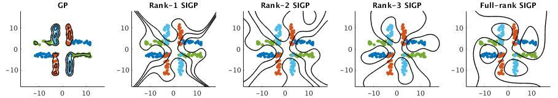

# SIGP
Subspace-Induced Gaussian Processes - Gaussian processes induced by sufficient dimension reduction subspaces of the reproducing kernel Hilbert space.

## Comparing SIGP to standard Gaussian process regression
1. SIGP is computationally faster due to the low-rank of the covariance
2. SIGP is robust against overfitting (illustrated by the following example)



This figure illustrates the classification of 2D points using the standard Gaussian process regression (GP) and SIGP. There are four classes represented by different colors, and the decision boundary contours are shown. The contours of GP and SIGP successfully separate the four classes; however, GP tends to fit the data more tightly and hence has higher risk of overfitting. The SIGP with a higher rank covariance generally yields an increased margin between classes.

## Example: Classification of the ARCENE data

```matlab
disp("Loading the data ...");
feaTrain = load('data/arcene_train.data');
feaTest  = load('data/arcene_valid.data');
gndTrain = load('data/arcene_train.labels');
gndTest  = load('data/arcene_valid.labels');
% Standardizing the data
fea = [feaTrain;feaTest];
fea = fea - mean(fea);
fea = fea./max(std(fea),1e-12);
feaTrain = fea(1:100,:);
feaTest = fea(101:end,:);

disp("Classifying with SIGP ...");

hyp = sigp(feaTrain,gndTrain,3,'efn','ker',...
            'meankfn','sigp_rbf','meankpar',0.0011397,...
            'covkfn','sigp_rbf','covkpar',207.33,...
            'lambda',518.12,'normalize',false);

disp("F1 score:" + num2str(F1score(sign(hyp.f(feaTest)),gndTest)));
```

In Matlab:
```
>> Example
Loading the data ...
Classifying with SIGP ...
F1 score:0.85714
```

### Fitting the Kernel Parameters using Cross-Validation
One way to select the kernel is to use the cross-validation. The example scripts trainLR.m, trainMS.m, and trainRT.m combine cross-validation and Baysian optimization for this task:

In Matlab:
```matlab
res = trainMS(X,y,10,5);
```
X,y are the regression feature matrix and response. The other parameters specify a rank-10 SIGP and 5 CV paritions to use. 
The kernel parameters can also be learned using the marginal likelihood.

### Details
If you use SIGP in your applications, kindly consider citing the paper "Subspace-Induced Gaussian Processes": https://arxiv.org/pdf/1802.07528.pdf

