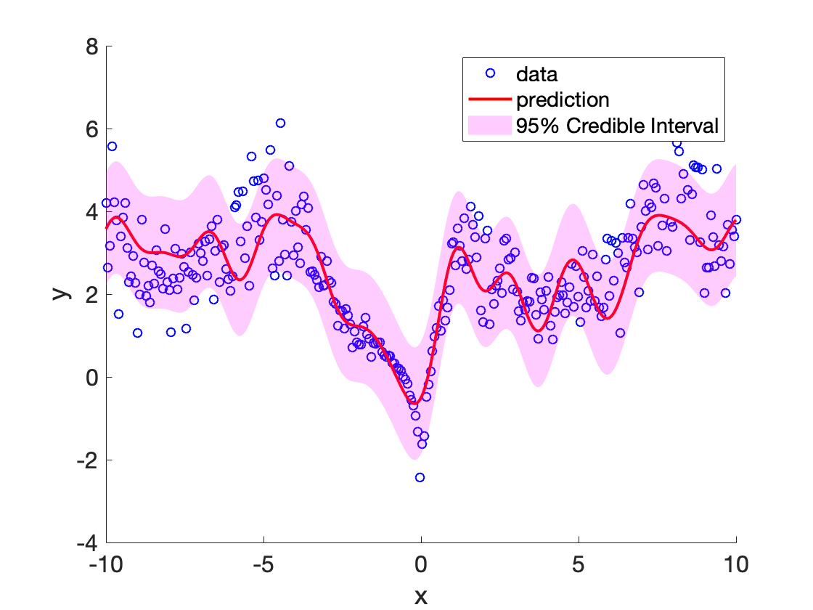

# SIGP
Subspace-Induced Gaussian Processes - Gaussian processes parameterized by sufficient dimension reduction subspaces of the reproducing kernel Hilbert space.

More details can be found in our paper: https://arxiv.org/abs/1802.07528

## Comparison of SIGP and the standard Gaussian process
1. SIGP can realize more functions than GP for the same covariance kernel
2. SIGP admits faster inference
3. SIGP is robust against overfitting

## Example 1: Predictive Distribution of SIGP


## Example 2: Classification of the ARCENE data

```matlab
disp("Loading the data ...");
feaTrain = load('data/arcene_train.data');
feaTest  = load('data/arcene_valid.data');
gndTrain = load('data/arcene_train.labels');
gndTest  = load('data/arcene_valid.labels');

fea = [feaTrain;feaTest];
fea = fea - mean(fea);
fea = fea./max(std(fea),1e-12);
feaTrain = fea(1:100,:);
feaTest = fea(101:end,:);

disp("Classifying with SIGP ...");
hyp = sigp(feaTrain,gndTrain,1,'efn','cov',...
    'covkfn', 'sigp_rbf','covkpar',200.04,...
    'normalize',false);

disp("F1 score:" + num2str(F1score(sign(hyp.f(feaTest)),gndTest)));
```

In Matlab:
```
>> Example
Loading the data ...
Classifying with SIGP ...
F1 score:0.85714
```

### Fitting the Kernel Parameters using Cross-Validation
One way to select the kernel is to use the cross-validation. The example script trainCR.m combines cross-validation and Baysian optimization for this task:

In Matlab:
```matlab
res = trainCR(X,y,1,3);
```
X,y are the regression feature matrix and response. The other parameters specify a rank-1 SIGP and 3 CV paritions to use. 
The kernel parameters can also be learned using the marginal likelihood.


